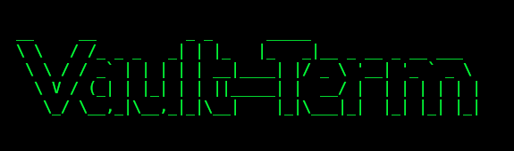

# Vault-Term

## About it

Vault-Term is a productivity software to manage projects in the terminal in a more comfy way.

In Vault-Term you can create and manage your projects from the terminal, it is oriented towards productivity and note taking, but you can also write code with it.

It's based on the [Obsidian](https://obsidian.md/) philosophy and it's open source, so any contribuitions are welcome :)

## Dependencies

The project was build it in [Python 3.12.5](https://www.python.org/) and it uses the following dependencies and projects:

### Figlet - [figlet](https://github.com/cmatsuoka/figlet)

This project uses **figlet** to generate ASCII art, specifically the Vault-Term logo. You can get more information about it by visiting the [project repository](https://github.com/cmatsuoka/figlet)

### Tabulate - [tabulate](https://pypi.org/project/tabulate/)

This project uses **tabulate** to create pretty ASCII tables embebed in terminal. You can get more info about tabulate [here](https://pypi.org/project/tabulate/).

### Inquirer - [inquirer](https://pypi.org/project/inquirer/)

This project uses **inquirer** to ease the flow into the Vault-Term menu. You can visit the [python project page](https://pypi.org/project/inquirer/) to get more information.
