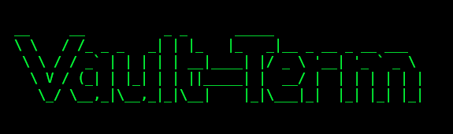
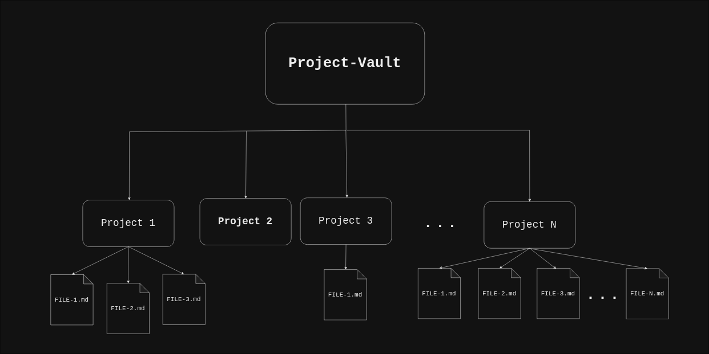
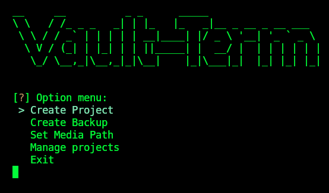
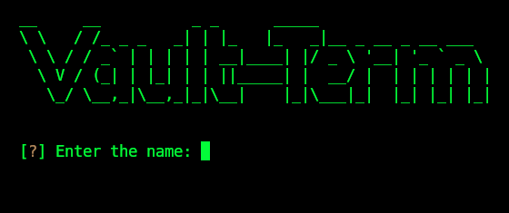
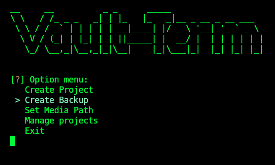
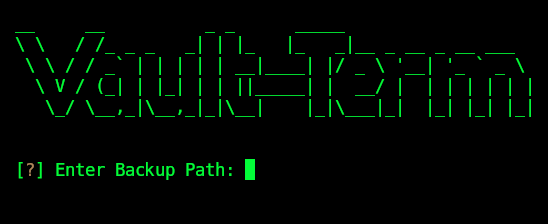
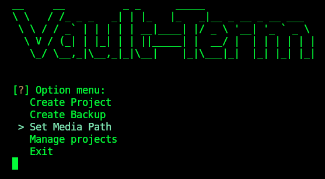
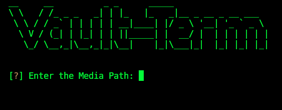

# Vault-Term Documentation

 

 

## Notes of the software

All the changes are made in the filesystem of your machine so you can move and create folders as you wish for create or delete projects or create a new Project-Vault but the goal of this sofware is to simplify that process oriented to notetaking and productivity. 

Also the software is in a development fase so may not have all the bounds checks and validations so made changes on your own risk.

## Definitions

### What is the Project-Vault?

The Project-Vault is the central piece of the software and is created when you create your first Project. Is the folder where all the Projects are saved.

For now you can only have one Project-Vault where Vault-Term was installed but you can create how many backups you want in another directorys.

To create backups of the Project-Vault pick on the "Create Backup" option in the main menu.

### What is a Project?

A Project is a folder created into the Project-Vault and it contains all the .md files (or with another extension), 

The Projects would be created into the Project-Vault and is basically a folder where you would create and save all the .md files, or files with another extension, for after edition or consulting.  

### Project-Vault and Projects structure tree

The Project-Vault tree should be like this:

## How to use

Once you has successfully installed Vault-Term run the "Vault.sh" with ./Vault.sh script to launch the main program.

## Main menu

After you ran the "Vault.sh" script you would see the main menu:

For now the following options are available:

- Create Project
- Create Backup
- Set Media Path
- Manage projects
- Exit

Use the arrow keys up and down to choose an option.

## Options description

### Create Project

To Create a new Project pick the "Create Project" option in the main menu. It would ask you for a project name and then creates a new project with that name in the Project-Vault.

To Manage your Projects see the "Manage Projects" option.

If you choose this option for error click the enter key without writing anything and that will take you to the main menu.

If you choose this option for error click the enter key without writing anything and that will take you to the main menu.

### Create Backup

The "Create Backup" option creates a backup of the Project-Vault in the target directory path.

This option creates a folder labeled "Projet-Vault" in the target path and it another "Project-Vault" exists in the target it will relabel the Vault with an a N suffix.

"Create Backup" option in the main menu:

Into the "Create Backup" option:

If you choose this option for error click the enter key without writing anything and that will take you to the main menu.

### Set Media Path

When you create the first Project, Vault-Term creates a Project-Vault in the media path that you set. 

By default the media path is setted in the path that is installed Vault-Term but with this option you can create a vault in another path that could be in a live media or in the current device but in another directory. So you can work and create Projects into a live media and carry with these wherever you like.

For now the media path is restored to the current path that is installed Vault-Term every time you restart but in the future it could be changed.

If you choose this option for error click the enter key without writing anything and that will take you to the main menu.

### Manage projects

By chosing the "Manage Projects" option you can Manage all the Projects that you created wiht the "Create Project" option.

When you choose this option a Project Table where display and it would ask you for the Project name you would like to work on.

If there's not a Project-Vault created, you must create a new Project and then Vault-Term creates a new Project Vault in the current directory path or if you like has a Project-Vault already created in another path you can work on it by choosing it in the "Set Media Path" option into the main menu.

After you enter the name of the Project you would like to work on Vault-Term displays a table with all the files into the Project and it would ask you to enter de file name to edit, if you enter a name that is not in the table it would create it for you and then open it with the Vim text edito so you must have it installed.

If you choose this option for error or would like to back to the main menu, click the enter key without writing anything and that will take you to the main menu.

### Exit

