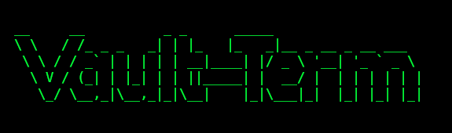
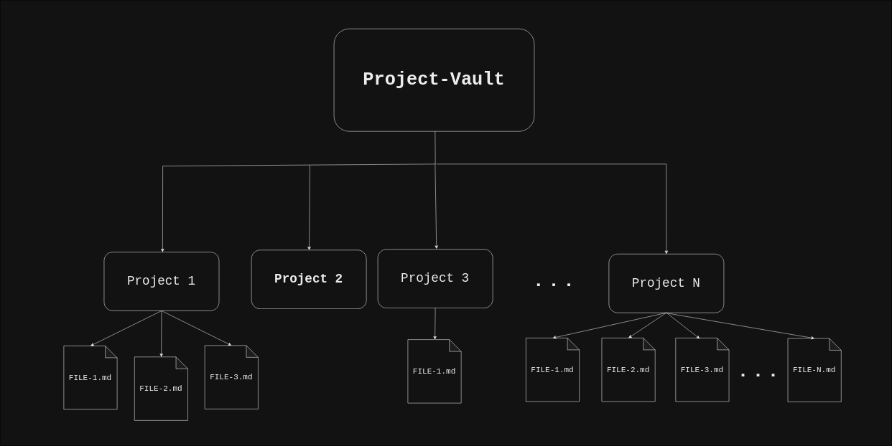
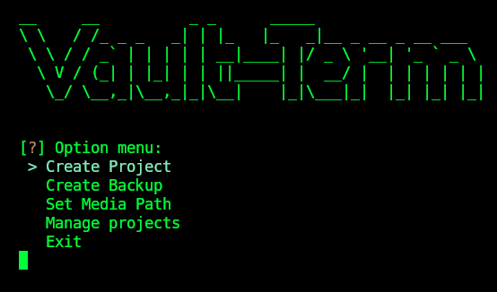
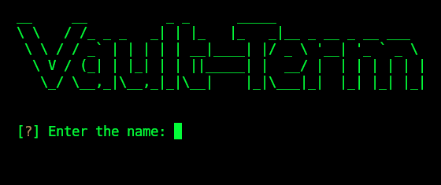
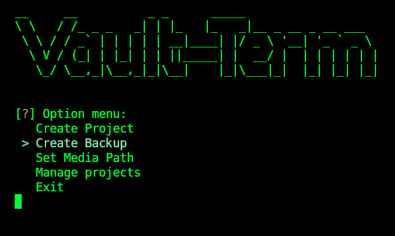
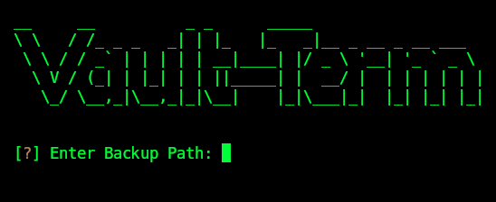
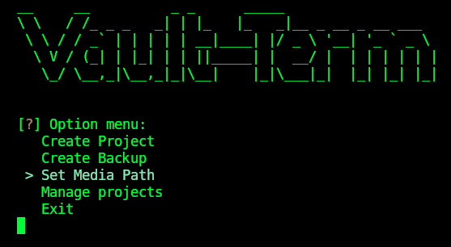
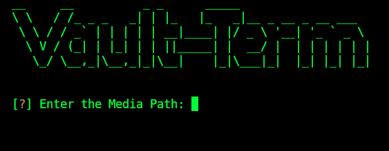

# Vault-Term Documentation

<br>



<br>
<hr>

## Table of Contents

- [Vault-Term Documentation](#vault-term-documentation)
- [Notes of the software](#notes-of-the-software)
- [Key Concepts](#key-concepts)
  - [What is the Project-Vault?](#what-is-the-project-vault)
  - [What is a Project?](#what-is-a-project)
  - [Project-Vault and Projects structure tree](#project-vault-and-projects-structure-tree)
- [How to use](#how-to-use)
- [Main menu](#main-menu)
- [Features & Options](#features--options)
  - [Create Project](#create-project)
  - [Create Backup](#create-backup)
  - [Set Media Path](#set-media-path)
  - [Manage projects](#manage-projects)
  - [Exit](#exit)

## Notes of the software

All the changes are made in the filesystem of your machine so you can move and create folders as you wish for create or delete projects or create a new Project-Vault but the goal of this sofware is to simplify that process oriented to notetaking and productivity. 

Also the software is in a development fase so may not have all the bounds checks and validations so made changes on your own risk.

## Key Concepts

### What is the Project-Vault?

The **Project-Vault** is the core storage directory of Vault-Term. It is automatically created when you initialize your first project, serving as the container for all subsequent projects.

Currently, only one Project-Vault can exist in the installation directory. However, you can create multiple backups in other directories as needed. 

To create a backup, select **"Create Backup"** from the main menu.


### What is a Project?

A **Project** is a subfolder within the Project-Vault that contains markdown (`.md`) files or other document formats. Each project serves as a workspace for storing and editing notes.

The Projects would be created into the Project-Vault and is takes the form of a folder where edit, create and save all the .md files, or files with another extension, for after edition or consulting.  


### Project-Vault and Projects structure tree

A **Project-Vault** follows this hierarchical structure:




## How to use

After installing Vault-Term, execute the following command to launch the program:

```bash
./Vault.sh
```

## Main menu

Upon running `Vault.sh`, the main menu will appear:


The following options are available:

- **Create Project** – Initialize a new project within the Project-Vault.
- **Create Backup** – Generate a backup of the Project-Vault in a target directory.
- **Set Media Path** – Specify an alternative directory for storing projects.
- **Manage Projects** – Access and modify existing projects.
- **Exit** – Close Vault-Term.

Use the arrow keys to navigate the menu and press **Enter** to select an option.

## Features & Options

### Create Project

1. Select **"Create Project"** from the main menu.
2. Enter a project name when prompted.
3. A new folder with the specified name will be created inside the Project-Vault.

If you accidentally select this option, press **Enter** without entering a name to return to the main menu.




### Create Backup

The **"Create Backup"** option saves a copy of the Project-Vault in a specified target directory.

- If a **Project-Vault** already exists in the destination, a numerical suffix (e.g., `Project-Vault_1`, `Project-Vault_2`) is added to differentiate backups.




If you accidentally select this option, press **Enter** without specifying a path to return to the main menu.

### Set Media Path

The **"Set Media Path"** option allows you to specify a custom storage location for your Project-Vault.

- By default, Vault-Term creates the Project-Vault in its installation directory.
- You can redirect storage to an external drive or another directory to maintain portable projects.
- Note: The media path resets to the default location after each restart.




If you choose this option for error press **Enter** key without writing anything and that will take you to the main menu.

### Manage projects

The **"Manage Projects"** option allows you to access and modify existing projects.

1. Select **"Manage Projects"** from the main menu.
2. A table displaying available projects will appear.
3. Enter the name of the project you want to work on.
4. A list of files within the project will be shown.
5. Enter the name of a file to edit. If the file does not exist, a new one will be created.
6. The file will open in Vim. Ensure Vim is installed on your system.

If you accidentally select this option or wish to return to the main menu, press **Enter** without entering a name.

### Exit

Select **"Exit"** to close Vault-Term once you are finished.


